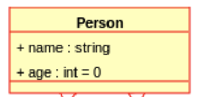

# ObjectsOne

What's the point of OOP? What's the _object_ of it all?

## Java Objects

To create an object in Java, you need to follow these steps:

Define a class: First, you need to define a class that describes the object's properties and behavior. A class is a blueprint for an object. Youe place class code in a file with the same name as the class and a .java extension.

Declare an object: Once you have defined a class, you can declare an object of that class using the "new" keyword.

Initialize the object: After declaring the object, you need to initialize it using the class constructor.

Here is an example code snippet that demonstrates these steps:

```java
// Define a class
class Person {
    // Define Instance Variables
    // different for each object!
    String name;
    int age = 0;

    // Constructor
    public Person(String name, int age) {
        this.name = name;
        this.age = age;
    }

    public static void main(String[] args) {
        // Declare and initialize an object
        Person person1 = new Person("John", 30);

    /* Now you can use the Object `person1` */
        
    }
}

```

`person1` is the actual object, and `Person` is the class that describes the object.

In this example, we define a class called "Person" with two properties: "name" and "age". We also define a constructor that takes two parameters and initializes the object's properties. Finally, we declare and initialize an object of the "Person" class using the constructor.

_What might that "look" if you drew a quick diagram of it? Here is your first UML diagram._



### Now, create code in this project...

```
Create a Person.java file, next to the Main.java file, 
and put the class code above into that file.
```

```
Add a new instance variable, called "height", to the Person class. 
Make "height" an integer, note in a comment that the units are "centimeters". 
Make sure the constuctor initializes this instance variable to zero centimeters.```
```

```
Inside of Main.java, create a new Person object, 
and _log_ or print out the value of the "height" instance variable.
```

__Finally, what's the difference between a class and an object?__

_(tap, tap, tap... I'm waiting...)_

# Wait! What? NEW??

In Java, the new keyword is used to create a new instance (object) of/from a class.(Think "blueprint"). 
When a new object is created using the __new__ keyword, memory is allocated for the object and the constructor of the class is called to initialize the object.

Here is an example of creating a new object of a class called Person:

```java
Person person = new Person();
```

In this example, the new keyword is used to create a new instance of the Person class. The Person() constructor is called to initialize the object, and the resulting object is assigned to the person variable.

The new keyword can also be used to create arrays of objects. Here is an example of creating a new array of Person objects:

```java
Person[] people = new Person[10]; // an array of 10 Person objects

// what is an array? see below...
```

In this example, the new keyword is used to create a new array of Person objects with a length of 10. The resulting array is assigned to the `people` variable. (What's an array? We'll get to that later.)

The `new` keyword is an important part of Java programming that is used to create new objects and arrays.

## A Class for a "Car"

Here is another example of a Java class definition.

```java
public class Car {
    private String make;
    private String model;
    private int year;
    private int mileage;

    public Car(String make, String model, int year, int mileage) {
        this.make = make;
        this.model = model;
        this.year = year;
        this.mileage = mileage;
    }

    public String getMake() {
        return make;
    }

    public void setMake(String make) {
        this.make = make;
    }

    public String getModel() {
        return model;
    }

    public void setModel(String model) {
        this.model = model;
    }

    public int getYear() {
        return year;
    }

    public void setYear(int year) {
        this.year = year;
    }

    public int getMileage() {
        return mileage;
    }

    public void setMileage(int mileage) {
        this.mileage = mileage;
    }
}
```

what's with the `get` and `set` methods? well, they are called `getters` and `setters` and they are used to access the private instance variables of the class. 
(did you notice the `private` keyword? No? Go back and look again.) 
When the instance variables are `private`, they can only be accessed by the class (well, the object) itself. 
So, if you want to access them from outside the class, you need to use the `getters` and `setters`.

## A Class for a Chair

Here's an example class for a Chair in Java:

```java
public class Chair {
    private String material;
    private String color;
    private int legs;

    public Chair(String material, String color, int legs) {
        this.material = material;
        this.color = color;
        this.legs = legs;
    }

    public String getMaterial() {
        return material;
    }

    public void setMaterial(String material) {
        this.material = material;
    }

    public String getColor() {
        return color;
    }

    public void setColor(String color) {
        this.color = color;
    }

    public int getLegs() {
        return legs;
    }

    public void setLegs(int legs) {
        this.legs = legs;
    }
}
```
In this example, the Chair class has three instance variables: "material", "color", and "legs". It also has a constructor that takes three parameters to initialize these variables. Additionally, it has getters and setters for each of the instance variables to allow access to them from outside the class.

How would you create a `new` Chair object? (hint: look above...)

## A Class for a Dog

Here's an example class for a Dog in Java:

```java
public class Dog {
    private String name;
    private int age;
    private String breed;

    public Dog(String name, int age, String breed) {
        this.name = name;
        this.age = age;
        this.breed = breed;
    }

    public String getName() {
        return name;
    }

    public void setName(String name) {
        this.name = name;
    }

    public int getAge() {
        return age;
    }

    public void setAge(int age) {
        this.age = age;
    }

    public String getBreed() {
        return breed;
    }

    public void setBreed(String breed) {
        this.breed = breed;
    }
}
``` 

See those pesky `getters` and `setters` again? They are used to access the private attributes of the class. (did you notice the `private` keyword? No? Go back and look again.) When the attributes are `private`, they can only be accessed by the class itself. So, if you want to access them from outside the class, you need to use the `getters` and `setters`.  (Didn't I already say that?)

### Make some classes.

You made the `Person` class, now do the Chair, Dog and Car classes. (You can copy and paste the code above, and then change the names and attributes.)(or do you?)

# WAIT! WHAT? an Array??

In Java, an `array of objects` is collection that contains objects of a specific class.
This allows you to store multiple objects of the same class in a single data structure (array).
It is somewhat like a _list_, but there are ver specific, technical, reasons we call it an _array_ and not a _list_.

To create an array of objects, you first need to create a class that represents the objects you want to store. For example, let's say you want to create an array of Person objects. You would create a Person class like this:

```java
public class Person {
    private String name;
    private int age;

    public Person(String name, int age) {
        this.name = name;
        this.age = age;
    }

    // getters and setters (wait, what's a setter? a getter?)
}
```

This class has two instance variables (name and age) and a constructor that takes two parameters (name and age). It also has getters and setters for the instance variables.

To create an array of Person objects, you would use the following syntax:

```java
Person[] people = new Person[10];
```

This creates an array of Person objects with a length of 10. You can then create individual Person objects and store them in the array like this:

```java
Person person1 = new Person("Alice", 25);
Person person2 = new Person("Bob", 30);

people[0] = person1;
people[1] = person2;
```

This creates two Person objects (person1 and person2) and stores them in the first two elements of the people array.

You can also access individual Person objects in the array using array indexing:

```java
Person person = people[0];
```

This retrieves the Person object at index 0 of the people array and stores it in the person variable.

An array of objects in Java allows you to store multiple objects of the same class in a single array, making it a powerful tool for managing collections of objects.

How would you make an array of Chair? Or Dog? Or Car? You should _experiment_, because you can learn coding much faster if you experiment. (And you can't break anything, so don't worry about that.)

### because you know...

Ask a NYC cabbie "how do I get to Carnegie Hall?" and they will say "practice, practice, practice".

### And finally, what's with the number scheme in a Java Array??

In Java, the numbering of elements in an array starts at 0. This means that the first element in the array is at index 0, the second element is at index 1, and so on.

For example, consider the following array of integers:

```java
int[] numbers = {1, 2, 3, 4, 5};

//    yes, {1, 2, 3, 4, 5}
// numbers [0, 1, 2, 3, 4]
// numbers[0] == 1
// numbers[1] == 2
// numbers[2] == 3
// numbers[3] == 4
// numbers[4] == 5
// GET IT??
```

In this array, the number 1 is at index 0, the number 2 is at index 1, the number 3 is at index 2, and so on.

To access an element in an array, you use the array index. For example, to get the value of the third element in the numbers array, you would use the following code:

```java
int thirdNumber = numbers[2];
```

In this example, the index 2 is used to access the third element in the numbers array.

__It is CRUCIAL__ to remember that the numbering of elements in a Java array starts at __0__, not __1__!!!

## Are you done?

Then make sure you have added, committed and pushed your work to GitHub! (Using a terminal shell...)

```bash
git add .
git commit -m "some useful message reminding you of wht you did"
git push
```

And then, make sure your last commit is tagged with `finished` and then you can move on to the next lesson.
